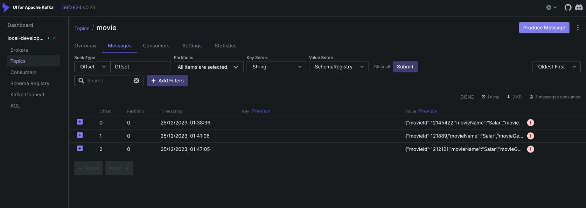
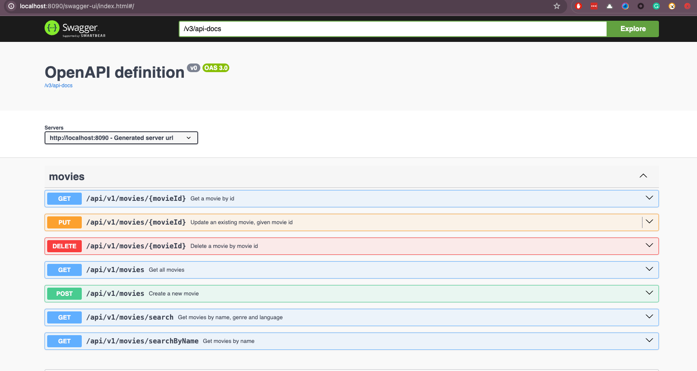

# Spring boot REST API with MongoDB

This is simple REST API for movies. It is built using Spring Boot, MongoDB, Kafka, Docker, and Maven.

## Features

- Create a movie
- Update a movie
- Delete a movie
- Get a movie by id
- Get all movies
- Get all movies by Country
- Get all movies by genre
- Get all movies by release date
- Get all movies by rating
- Delete movie by id

## Requirements

- Java 17
- Docker
- Docker Compose
- Maven
- MongoDB
- Kafka
- MongoDB Compass
- Redis
- Postman

### Start the MongoDB database

```bash
docker-compose up -d
```

### Build the application

`jar` file will be generated in `target` folder.

```bash
./mvnw clean package -DskipTests
```

## Metrics

Access Prometheus at: http://localhost:8090/actuator/prometheus

## kafka

Movie events are published to a Kafka topic when a movie is created or updated,

### Run Just Kafka services
```bash
docker-compose -f docker-compose.kafka.yml up -d
```

Kafka can be accessed at localhost:9092, also available via the Kafka UI at http://localhost:8080/.



### Redis
Spring boot service uses Redis to cache movie data.

Redis can be accessed at `localhost:6379`, also available via the Redis UI at http://localhost:8001/.

## Swagger

Access Open API documentation at: http://localhost:8090/swagger-ui/index.html

API documentation is also available in JSON format at: http://localhost:8090/v3/api-docs


